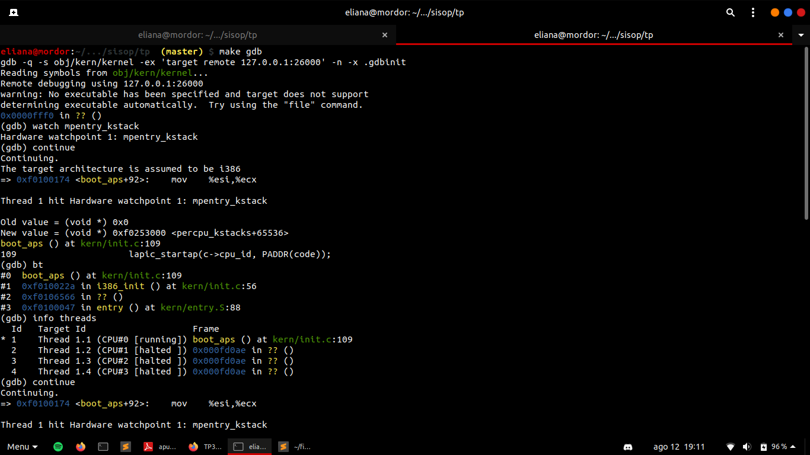
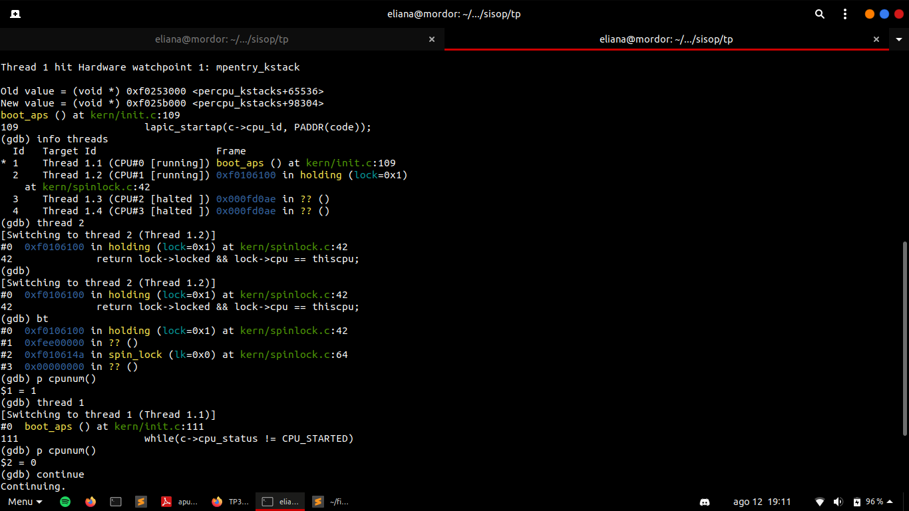
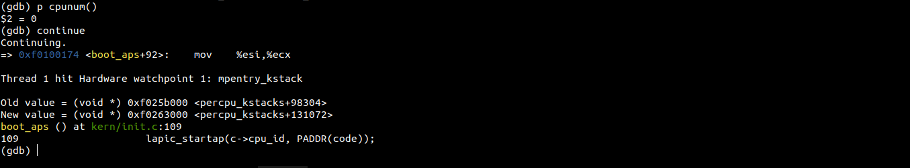
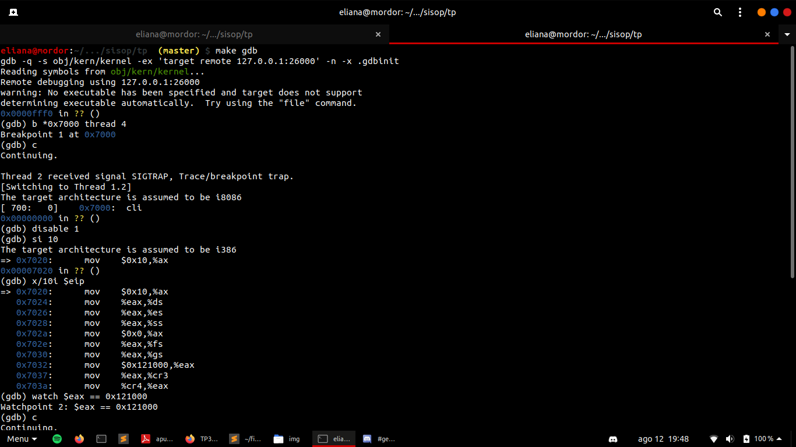
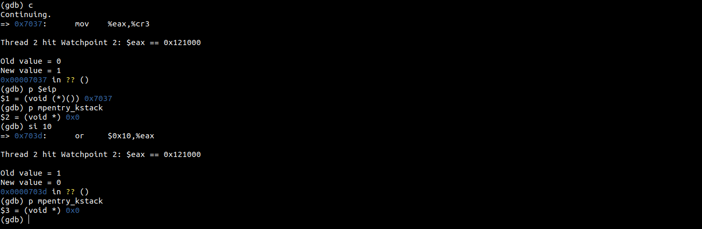

## Parte 1

### Tarea: env_return

- Al terminar un proceso su función `umain()` ¿dónde retoma la ejecución el kernel? Describir la secuencia de llamadas desde que termina umain() hasta que el kernel dispone del proceso.

  En el archivo `lib/entry.S` se invoca a la función `libmain()`, aquí se setea la variable global thisenv y, por último, se invoca a la función `umain()`; una vez que finaliza la ejecución de la función `umain()`, `libmain()` retoma el control e invoca a `exit()` para que el kernel retome el control, disponga del proceso y libere los recursos utilizados cuando lo considere.

- ¿En qué cambia la función `env_destroy()` en este TP, respecto al TP anterior?

  En el trabajo anterior manejábamos un solo proceso, por lo que no se realizaba ninguna validación previo a liberarlo. En esta implementación manejamos múltipes estados y procesos; luego de liberar al proceso en cuestión con la función `env_free()`, el kernel se encarga de invocar al scheduler (a través de la función `sys_yield()`) para poder administrar la ejecución de otros procesos.

### Tarea: sys_yield

- Leer y estudiar el código del programa user/yield.c. Cambiar la función `i386_init()` para lanzar tres instancias de dicho programa, y mostrar y explicar la salida de make qemu-nox.
  
  ```
  Booting from Hard Disk..6828 decimal is 15254 octal!
  Physical memory: 131072K available, base = 640K, extended = 130432K
  check_page_free_list() succeeded!
  check_page_alloc() succeeded!
  check_page() succeeded!
  check_kern_pgdir() succeeded!
  check_page_free_list() succeeded!
  check_page_installed_pgdir() succeeded!
  SMP: CPU 0 found 1 CPU(s)
  enabled interrupts: 1 2
  [00000000] new env 00001000
  [00000000] new env 00001001
  [00000000] new env 00001002
  Hello, I am environment 00001000, cpu 0.
  Hello, I am environment 00001001, cpu 0.
  Hello, I am environment 00001002, cpu 0.
  Back in environment 00001000, iteration 0, cpu 0.
  Back in environment 00001001, iteration 0, cpu 0.
  Back in environment 00001002, iteration 0, cpu 0.
  Back in environment 00001000, iteration 1, cpu 0.
  Back in environment 00001002, iteration 1, cpu 0.
  Back in environment 00001000, iteration 2, cpu 0.
  Back in environment 00001001, iteration 1, cpu 0.
  Back in environment 00001002, iteration 2, cpu 0.
  Back in environment 00001000, iteration 3, cpu 0.
  Back in environment 00001001, iteration 2, cpu 0.
  Back in environment 00001002, iteration 3, cpu 0.
  Back in environment 00001000, iteration 4, cpu 0.
  All done in environment 00001000.
  [00001000] exiting gracefully
  [00001000] free env 00001000
  Back in environment 00001002, iteration 4, cpu 0.
  All done in environment 00001002.
  [00001002] exiting gracefully
  [00001002] free env 00001002
  Back in environment 00001001, iteration 3, cpu 0.
  Back in environment 00001001, iteration 4, cpu 0.
  All done in environment 00001001.
  [00001001] exiting gracefully
  [00001001] free env 00001001
  No runnable environments in the system! 
  Welcome to the JOS kernel monitor!
  Type 'help' for a list of commands.
  K> QEMU: Terminated
  ```

  El código del programa user/yield.c realiza un `for` invocando a la función sys_yield() y luego de retomar el control del CPU, imprime por salida estándar un mensaje para indicar que retomó la ejecución, el PID del proceso que está ejecutándose y el número de iteración en la que nos encontramos. Al modificar `i386_init()` para lanzar tres instancias de dicho programa, la salida obtenida es la que esperamos: se crean 3 instancias del programa yield, se ejecutan en orden y cada uno de ellos llama a la función `sys_yield`, primero lo hace el primer proceso (cuyo `env_id` es 00001000), luego el segundo (cuyo `env_id` es 00001001) y, finalmente, el último (cuyo `env_id` es 00001002); el scheduler devolverá el control a cada uno de ellos en el mismo orden. 
  Primero, el primer proceso lanzado finalizará la primera iteración del ciclo, entrará en la segunda iteración y devolverá el control al kernel que entregará el control al segundo proceso para que se ejecute y finalice su primera iteración; el segundo proceso comenzará la segunda iteración del ciclo y le dará el control al kernel, y así sucesivamente.
  Se evidencia el algoritmo `round-robin` utilizado en la implementación del scheduler.

## Parte 2

### Tarea: envid2env

#### Responder qué ocurre:

  - en JOS, si un proceso llama a `sys_env_destroy(0)`
  
    Cuando se realiza este llamado, lo primero que hace la syscall es conseguir el `struct Env*` asociado con ese envid, haciendo uso de la función `envid2env(0)`;   al invocarse esta función con argumento 0, la misma devuelve el proceso ejecutándose actualmente, es decir curenv. Por último, se invoca a la función `env_destroy()` para destruir el proceso actual y se invoca al scheduler para correr otro programa que se encuentre en estado `RUNNABLE`.
  
  - en Linux, si un proceso llama a `kill(0, 9)`
  
    Si un proceso llama kill(0, 9), destruirá a todos los procesos cuyo Group ID sea el mismo que el suyo (destruyéndose, también, a si mismo).
    
#### E ídem para:

  - JOS: `sys_env_destroy(-1)`
  
  Si se le pasa el argumento -1 a la función `envid2env`, la misma tratará de encontrar el `struct Env*` del proceso asociado a ese id en el array de procesos y destruirlo. Si el ambiente en cuestión no fue creado, devolverá -E_BAD_ENV.
  
  - Linux: `kill(-1, 9)`
  
  En el manual de Linux tenemos:

  `If pid equals -1, then sig is sent to  every  process  for  which  the calling  process  has permission to send signals, except for process 1 (init), but see  below.`

  Entonces, si un proceso llama a `kill(-1,9)`, destruirá con el sigkill 9 a todos los procesos para los que el proceso invocante tiene permiso de mandar señales, excepto al proceso `init`.
  
### Tarea: dumbfork

#### Tras leer con atención el código, se pide responder las siguientes preguntas:

- Si antes de llamar a `dumbfork()`, el proceso se reserva a sí mismo una página con `sys_page_alloc()` ¿se propagará una copia al proceso hijo? ¿Por qué?

	La página en cuestión se mapeará en su address space en la virtual address indicada como argumento. Si el mapeo se realiza dentro de los límites de las secciones `Pogram Data & Heap` o `Normal User Stack`, entonces se propagará una copia de dicha página al hijo porque la función `dumfork` copia al address space al hijo de las páginas contenidas en estas secciones.

- ¿Se preserva el estado de solo-lectura en las páginas copiadas? Mostrar, con código en espacio de usuario, cómo saber si una dirección de memoria es modificable por el proceso, o no. (Ayuda: usar las variables globales uvpd y/o uvpt.)

	No se preserva el estado de solo-lectura ya que a todas las páginas copiadas se le dan los permisos de escritura y lectura, independientemente de los permisos originales de la página en cuestión.

```c
pde_t pde = uvpd[PDX(va)];
if (pde & PTE_P) {
  pte_t pte = uvpt[PGNUM(va)];
  if (pte & PTE_P) {
    if (pte & PTE_W) cprintf("Es modificable\n");
    else cprintf("No es modificable\n");
  }
}
```

- Describir el funcionamiento de la función `duppage()`.

	Aloca una página para el proceso destino y la mapea en la dirección `addr`. Luego, mapea esta página en la dirección UTEMP del padre. Después, el padre copia la página asociada a la dirección `addr` en la dirección UTEMP. Por último, desmapea las direcciones mapeadas en la dirección UTEMP del padre.


- Supongamos que se añade a `duppage()` un argumento booleano que indica si la página debe quedar como solo-lectura en el proceso hijo:

  - Indicar qué llamada adicional se debería hacer si el booleano es `true`
		
	Si `duppage()` recibe true en sus argumentos, se debería cambiar los permisos de la página en cuestión remapeando a la misma en la nueva dirección mediante el uso de la syscall `sys_page_map`. Luego, se debería realizar la siguiente llamada adicional:
	
	 `sys_page_map(dstenv, addr, dstenv, addr, PTE_U | PTE_P)`  (obviamente se deberían chequear errores validando si el valor de retorno de la syscall es menor a 0 y lanzar un `panic` en ese caso)

  - Describir un algoritmo alternativo que no aumente el número de llamadas al sistema, que debe quedar en 3 (1 × alloc, 1 × map, 1 × unmap).
	
	Alocamos una página para el padre y la mapeamos en `UTEMP`. Copiamos la página asociada a la dirección addr del padre en la página asociada a la dirección UTEMP. Mapeamos esta página en la dirección addr del hijo. Por último, desmapeamos las direcciones en UTEMP del padre.

- ¿Por qué se usa `ROUNDDOWN(&addr)` para copiar el stack? ¿Qué es addr y por qué, si el stack crece hacia abajo, se usa `ROUNDDOWN` y no `ROUNDUP`?

Se usa addr por que es una variable local (y por lo tanto vive en el stack). Además, usamos `ROUNDOWN` por que queremos el principio de la página asociada a la dirección de la variable addr.

## Parte 3

1. ¿Qué código copia, y a dónde, la siguiente línea de la función boot_aps()?

```memmove(code, mpentry_start, mpentry_end - mpentry_start);```

Se carga en memoria baja la direccion virtual en la que esta mapeada ```MPENTRY_PADDR``` que equivale al valor hexadecimal ```0x7000```

2. ¿Para qué se usa la variable global mpentry_kstack? ¿Qué ocurriría si el espacio para este stack se reservara en el archivo kern/mpentry.S, de manera similar a bootstack en el archivo kern/entry.S?

```mpentry_kstack``` apunta a la direccion mas alta del stack kernel de cada CPU

En entry.S setea el stack pointer de cada CPU y no sera lo mismo hacerlo en mpentry.S a no ser que se comparta el mismo stack para todas las CPUs. 
Esto no seria conveniente ya que cada CPU esta preparada para recibir sus propias interrupciones sin pisar la informacion actual.

3. Cuando QEMU corre con múltiples CPUs, éstas se muestran en GDB como hilos de ejecución separados. Mostrar una sesión de GDB en la que se muestre cómo va cambiando el valor de la variable global mpentry_kstack:





4. 

En el archivo kern/mpentry.S se puede leer:

```# We cannot use kern_pgdir yet because we are still
# running at a low EIP.
movl $(RELOC(entry_pgdir)), %eax
```

* ¿Qué valor tendrá el registro %eip cuando se ejecute esa línea?
- Responder con redondeo a 12 bits, justificando desde qué región de memoria se está ejecutando este código.

Ese valor corresponde al entry_point que se menciono antes de la direccion MPENTRY_PADDR que tiene el valor ```0x7000``` que redondeado a 12 bits es el mismo

* ¿Se detiene en algún momento la ejecución si se pone un breakpoint en mpentry_start? ¿Por qué?

No se detiene la ejecucion con el breakpoint porque no hay una direccion en donde este mapeada esa instruccion porque el CPU esta en real-mode y desconoce la memoria virtual

5. Con GDB, mostrar el valor exacto de %eip y mpentry_kstack cuando se ejecuta la instrucción anterior en el último AP. Se recomienda usar, por ejemplo:




## Parte 4

### Tarea: ipc_recv

#### La función `ipc_recv()` es el wrapper en user space de `sys_ipc_recv()`. Recibe dos punteros vía los que el proceso puede obtener qué proceso envió el mensaje y, si se envió una página de memoria, los permisos con que fue compartida. Una vez implementada la función, resolver este ejercicio:

- Un proceso podría intentar enviar el valor númerico `-E_INVAL` vía `ipc_send()`. ¿Cómo es posible distinguir si es un error, o no? En estos casos:

```c
// Versión A
envid_t src = -1;
int r = ipc_recv(&src, 0, NULL);

if (r < 0)
  if (/* ??? */)
    puts("Hubo error.");
  else
    puts("Valor negativo correcto.")
```
y:
```c
// Versión B
int r = ipc_recv(NULL, 0, NULL);

if (r < 0)	
  if (/* ??? */)
    puts("Hubo error.");
  else
    puts("Valor negativo correcto.")
```

Para la *version A*, debemos saber que un error en la llamada `ipc_recv` implica que en el wrapper ha fallado la ejecución de la syscall `sys_ipc_recv`. Como el argumento `from_env_store` es distinto de `NULL`, en caso de un error la syscall guardará en esa variable el valor 0. Entonces lo resolvemos con el siguiente código:

```c
	// Versión A
	envid_t src = -1;
	int r = ipc_recv(&src, 0, NULL);

	if (r < 0)
  	  if (src == 0)
    	     puts("Hubo error.");
  	else
	  puts("Valor negativo correcto.")
```

Para la *versión B* no podemos poner ninguna condición para saber si hubo un error o no porque el argumento src es `NULL`.

### Tarea: sys_ipc_try_send

#### Implementar la llamada al sistema sys_ipc_try_send() siguiendo los comentarios en el código, y responder:

- ¿Cómo se podría hacer bloqueante esta llamada? Esto es: qué estrategia de implementación se podría usar para que, si un proceso A intenta a enviar a B, pero B no está esperando un mensaje, el proceso A sea puesto en estado `ENV_NOT_RUNNABLE`, y sea despertado una vez B llame a `ipc_recv()`.

	Cuando un proceso intenta enviar un mensaje a otro proceso que no está esperando mensajes, se lo pondrá al mismo en espera hasta que el proceso destinatario del mensaje se predisponga a recibir un mensaje. En este caso, el estado del proceso emisor deberá setearse como "not runnable" y agregarse el mismo a un arreglo de procesos que aguardan ser "despertados". Cuando el proceso destinatario del mensaje en cuestión se predisponga a recibir un mensaje, deberá despertar a todos los procesos del arreglo y marcarlos como "runnable".

## Parte 6

### Tarea: fork

- ¿Puede hacerse con la función `set_pgfault_handler()`?

	No, esto no es posible puesto que el proceso hijo no está corriendo en este momento y obtendremos como resultado un `Page Fault` en caso de intentarlo.

- De no poderse, ¿cómo llega al hijo el valor correcto de la variable global `_pgfault_handler`?

	Mediante el `struct Env` de su padre (haciendo uso de la variable global `thisenv`).
